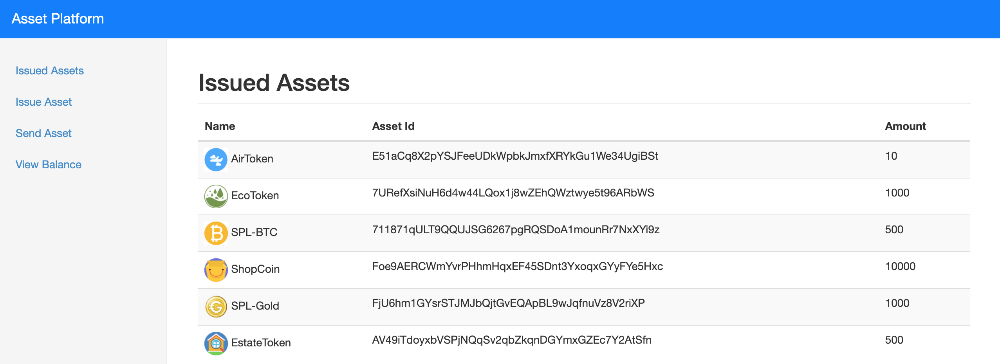
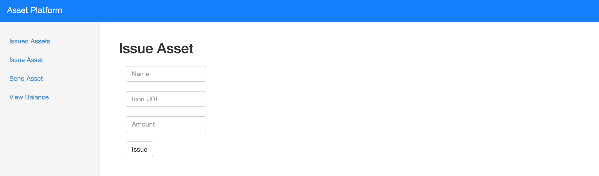
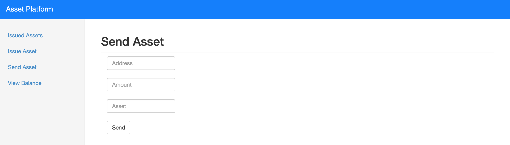
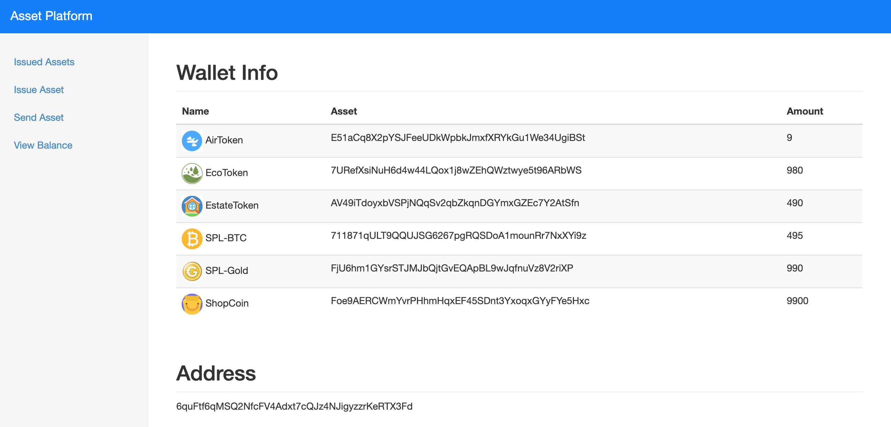
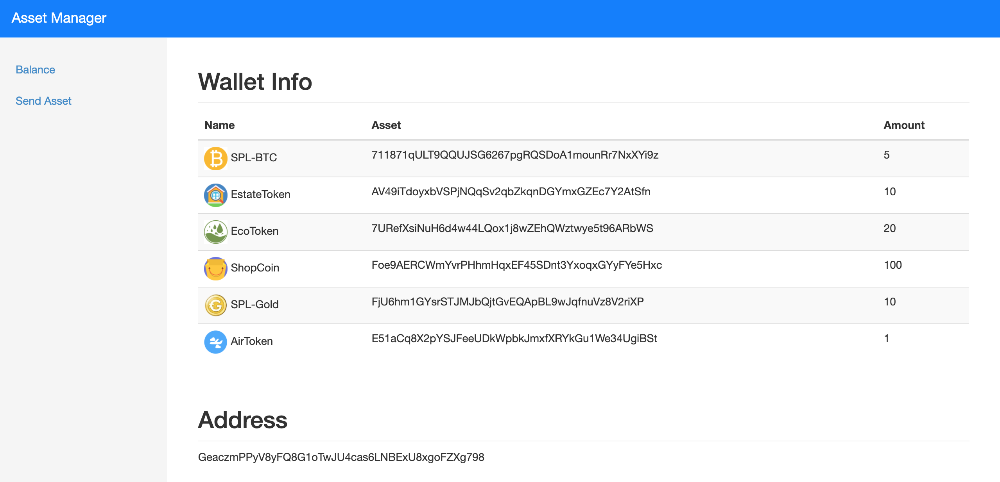
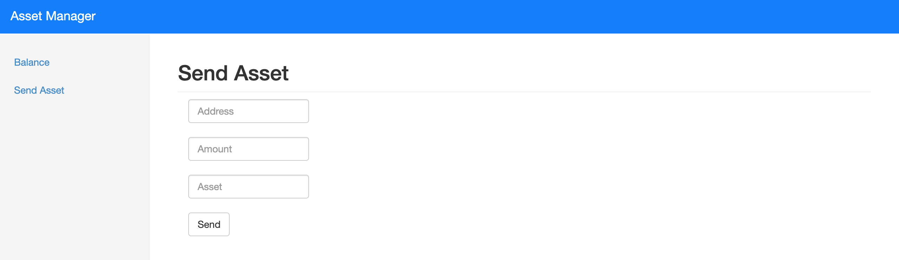

## Solana Asset Platform
Solana Asset Platform allows the Issuer to issue their own custom token assets powered by the Solana blockchain. These assets could represent loyalty points, tokenized fiat, crypto assets, digital collectibles, attested assets like gold, property etc.

Solana Asset Platform consists of two products:-

1. Asset Platform
    * Asset Issuer can use this platform to manage the entire lifecycle of the Assets.
    * Features include the ability to issue assets, send assets, view issued assets, view balances, etc.
2. Asset Manager
    * Asset holder can use this platform to manage their asset holdings.
    * Features include the ability to buy assets, trade assets, view balances, etc.


## Screenshots

#### Asset Platform








#### Asset Manager





## Getting started

1) Clone Repo
   ```
   git clone https://github.com/viraja1/solana_asset_platform.git 
   ```
   
2) Change directory
   ```
   cd solana_asset_platform
   ```
   
3) Install Docker and Docker Compose

   Docker install: https://docs.docker.com/install/#server
   
   Docker Compose install: https://docs.docker.com/compose/install/
   
4) Build Docker Images    
   ```
   docker-compose -f docker-compose.yml build     
   ```
   
5) Start Docker containers

   Run the below command to launch 2 docker containers named issuer_app and buyer_app. 
   
   ```
   docker-compose -f docker-compose.yml up -d     
   ```
   
6) Check Issuer App (Asset Platform)

   http://localhost:5000
   
7) Check Buyer App (Asset Manager)

   http://localhost:5001
   
8) Airdrop testnet SOL to Issuer and Buyer for testing devnet flow

   ```
   docker exec -it issuer_app bash
   solana airdrop 10
   ```
   
   ```
   docker exec -it buyer_app bash
   solana airdrop 10
   ```
   
9) Issue Asset using Issuer App

   Issue a new asset from the Issue Assets page (http://localhost:5000/issue_asset/). 
   Enter the asset name as `ShopCoin`. Then enter valid icon url & fill amount as `1000`. 
   Finally click on Issue button. All the issued assets are visible on the 
   homepage (http://localhost:5000/).
   
10) Issuer sends the asset to Buyer

    Send `10` units of the Asset to the Buyer from the Issuer App 
    (http://localhost:5000/send_asset/). Enter Buyer address, amount as `10`
    and the asset identifier (Unique id visible in the issued assets page - http://localhost:5000/).
    
11) Buyer sends the asset to another address

    Send `2` units of the Asset to another address from the Buyer App 
    (http://localhost:5001/send_asset/). Enter recipient address, amount as `2`
    and the asset identifier (Unique id visible in the homepage - http://localhost:5001/).